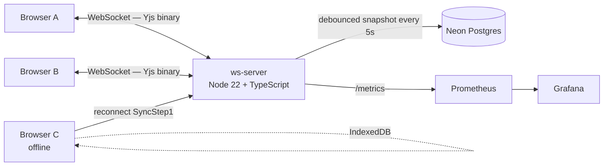

# CRDT Collaborative Document

> Notion-style real-time multiplayer editor. Multiple cursors. Conflict-free offline sync. Powered by Yjs CRDTs, end-to-end TypeScript.

[](https://github.com/Utkarsh272/crdt-collab/actions)
[](https://www.typescriptlang.org)
[](LICENSE)

[Live demo](https://crdt-collab.vercel.app) · [Architecture](#architecture) · [How CRDTs work](#how-crdts-work) · [Design notes](DESIGN.md)

---

## What & Why

Real-time collaborative editing is a deceptively hard problem. Every multiplayer product — Notion, Figma, Linear — has an engineering story about how they handle conflicts when two users edit the same thing simultaneously.

This project implements that story from first principles using **Conflict-free Replicated Data Types (CRDTs)** — a mathematical structure guaranteeing that any two replicas, no matter how many concurrent edits they've accumulated, will always converge to the same state when reconnected. No central arbiter. No last-write-wins. No merge conflicts.

---

## Features

- **Multi-cursor editing** — every collaborator's cursor and selection visible in real time, labelled with name and deterministic color
- **Conflict-free merging** — concurrent edits to the same span resolve automatically; no data is silently dropped
- **Offline-first** — edits persist to IndexedDB; merge cleanly on reconnect with no manual intervention
- **Document persistence** — full Yjs state snapshots written to Neon Postgres every 5s (debounced, force-flush on disconnect); documents survive server restarts
- **Sharing** — invite collaborators by email or generate a read/write share link
- **Auth** — Google OAuth via Supabase

---

## Architecture



### WebSocket sync protocol (binary, not JSON)

Every message is a `Uint8Array` with a 1-byte type prefix. Type `0` is the sync channel; type `1` is the awareness channel (cursors). Initial handshake:

```
Client                          Server
  │── SyncStep1(stateVector) ──▶│  "Here's what I have"
  │◀─ SyncStep2(delta) ─────────│  "Here's what you're missing"
  │◀─ SyncStep1(stateVector) ───│  "Now send me what I'm missing"
  │── SyncStep2(delta) ─────────▶│
  │   (ongoing)                   │
  │── Update(delta) ─────────────▶│── broadcast to all room members
```

### Snapshot strategy

Documents live in memory while connections are active. On every Yjs update, a 5-second debounced timer schedules `Y.encodeStateAsUpdate(ydoc)` → Postgres. On first connection to a document, the latest snapshot is loaded in a single query. Stale snapshots beyond the last 50 are pruned async. On disconnect with no remaining connections, a force-flush fires immediately before the room is eligible for memory eviction (60s grace period).

---

## How CRDTs Work

A **CRDT** (Conflict-free Replicated Data Type) is a data structure that can be updated independently on multiple nodes and always merged correctly — with zero coordination. Unlike operational transform (used by older collaborative editors), CRDTs don't need a central server to serialize operations: the merge is a mathematical property of the data structure itself.

Yjs implements **YATA** (Yet Another Transformation Approach): each character insertion is assigned a globally unique ID (clientID + logical clock). When two clients insert at the same position simultaneously, the CRDT resolves the tie deterministically by client ID — the same way on every peer, without any server round-trip. Deletions are stored as tombstones rather than physical removes, so concurrent deletes from different clients are both preserved.

The practical result: **offline editing just works**. IndexedDB saves every local Yjs update. On reconnect, the client sends its state vector (`SyncStep1`). The server diffs its in-memory doc against that vector and sends back exactly the missing updates (`SyncStep2`). Yjs merges them in microseconds. No conflicts to resolve, no data loss — regardless of how long the client was offline or how many concurrent changes happened in the meantime.

---

## Tech Stack

| Layer | Choice | Why |
|---|---|---|
| Frontend | Next.js 14 + TypeScript + Tailwind | End-to-end TS — closes the gap |
| Editor | Tiptap + ProseMirror | Industry standard; first-class Yjs binding |
| CRDT | Yjs (YATA algorithm) | Most mature CRDT lib; Tiptap native support |
| WS server | Node.js + TypeScript + `ws` | Written from source — understand every line of the protocol |
| Offline | `y-indexeddb` | Official Yjs provider |
| Cursors | `@tiptap/extension-collaboration-cursor` | Wraps Yjs Awareness for ProseMirror |
| DB | Neon Postgres (serverless, free) | Snapshot storage |
| Auth | Supabase Auth (Google OAuth) | Free, 5 min setup |
| Observability | Prometheus + Grafana | `prom-client` in server; provisioned via Docker Compose |
| Hosting | Vercel (FE) + Fly.io (WS, sticky sessions) | Sticky sessions required for WebSocket |

---

## Repository Structure

```
crdt-collab/
├── .github/workflows/ci.yml     # TypeScript + test + build + Fly.io deploy
├── docker-compose.yml           # ws-server + Postgres + Prometheus + Grafana
├── infra/
│   ├── prometheus.yml           # Scrape config
│   └── grafana/provisioning/    # Auto-provisioned datasource + dashboard
├── packages/
│   ├── ws-server/
│   │   ├── fly/fly.toml         # Fly.io deployment config
│   │   ├── fly/DEPLOY.md        # Step-by-step deploy guide
│   │   ├── Dockerfile
│   │   └── src/
│   │       ├── server.ts        # HTTP + WebSocket upgrade, room loading
│   │       ├── room.ts          # Yjs sync protocol from scratch
│   │       ├── persistence.ts   # Debounced Postgres snapshots
│   │       ├── auth.ts          # Supabase JWT verification
│   │       ├── api.ts           # REST CRUD (documents, sharing)
│   │       ├── metrics.ts       # Prometheus counters/gauges
│   │       └── tests/
│   │           ├── helpers/room-harness.ts  # In-process test harness
│   │           └── room.test.ts             # Conflict + sync tests
│   └── web/
│       ├── vercel.json
│       └── app/
│           ├── components/
│           │   ├── collaborative-editor.tsx  # Tiptap + Yjs + WS + IndexedDB
│           │   ├── editor-toolbar.tsx
│           │   ├── presence-list.tsx
│           │   ├── connection-status.tsx
│           │   ├── document-list.tsx
│           │   └── share-dialog.tsx
│           ├── docs/[id]/page.tsx
│           ├── login/page.tsx
│           └── page.tsx
```

---

## Local Development

### Prerequisites

- Node.js 22+, pnpm 9+
- [Neon](https://neon.tech) project (free) — for `DATABASE_URL`
- [Supabase](https://supabase.com) project with Google OAuth enabled — for `SUPABASE_JWT_SECRET`, `NEXT_PUBLIC_SUPABASE_URL`, `NEXT_PUBLIC_SUPABASE_ANON_KEY`

### Setup

```bash
git clone https://github.com/Utkarsh272/crdt-collab
cd crdt-collab
pnpm install

# Fill in secrets
cp packages/ws-server/.env.example packages/ws-server/.env
cp packages/web/.env.example packages/web/.env.local

pnpm dev   # starts ws-server on :1234 and web on :3000 in parallel
```

Sign in at `http://localhost:3000`, create a document, open the same URL in a second browser tab — you'll see two cursors.

**Testing offline sync:** open DevTools → Network → Offline, make edits, go back online — watch the Syncing → Synced transition.

### Running tests

```bash
cd packages/ws-server
pnpm test            # run suite
pnpm test:coverage   # with coverage report
```

Tests use an in-process room harness with fake WebSocket connections — no DB, no TCP server required.

### Local observability stack

```bash
docker compose up postgres prometheus grafana
# Grafana: http://localhost:3001  (admin / admin)
# Prometheus: http://localhost:9090
# WS server metrics: http://localhost:1234/metrics
```

---

## Deployment

### Frontend → Vercel

1. Import `Utkarsh272/crdt-collab` on vercel.com
2. Set **Root Directory** to `packages/web`
3. Add environment variables: `NEXT_PUBLIC_SUPABASE_URL`, `NEXT_PUBLIC_SUPABASE_ANON_KEY`, `NEXT_PUBLIC_API_URL` (your Fly.io URL)

### WebSocket server → Fly.io

See [`packages/ws-server/fly/DEPLOY.md`](packages/ws-server/fly/DEPLOY.md) for step-by-step.

```bash
cd packages/ws-server
fly deploy --config fly/fly.toml
```

CI auto-deploys to Fly.io on every push to `main` (requires `FLY_API_TOKEN` secret in GitHub).

---

## Scaling Beyond This Demo

Designed for 10 concurrent editors per document on a single Fly.io instance. Beyond ~50 concurrent users:

- **Shard documents** across WS server instances using consistent hashing by `docId`
- **Use `y-redis`** for Redis pub/sub fan-out between instances — each instance subscribes to its documents' channels and broadcasts incoming updates
- **Separate the awareness channel** (high-frequency cursor updates, ephemeral) from the sync channel (durable state)

---

## Test Coverage — Conflict Scenarios

The test suite in `packages/ws-server/src/tests/room.test.ts` covers:

| Scenario | Expected result |
|---|---|
| Concurrent inserts at the same position | Both insertions survive; all clients converge to the same string |
| Concurrent deletes of overlapping ranges | Both deletions applied; no crash, no split-brain |
| Long offline edit (50 ops) + concurrent remote edits (10 ops) | Full merge on reconnect; all edits from both clients preserved |
| Format + concurrent delete of the same span | Delete wins; all clients converge to the same state |
| Last client disconnects | `scheduleSnapshot` called with `forceImmediate=true` |
| New client joins late | Receives complete merged state from the room's in-memory doc |

---

## Cross-project Standards

- [x] Public live demo URL
- [x] Architecture diagram (Mermaid)
- [x] `Dockerfile` + `docker-compose.yml` (with Prometheus + Grafana)
- [x] CI: TypeScript check + tests + build + Fly.io deploy on main
- [x] Prometheus metrics (`/metrics` endpoint, auto-provisioned Grafana dashboard)
- [x] Health check (`GET /healthz`)
- [x] `DESIGN.md` covering 7 key decisions + trade-offs + known limitations
- [x] Tests covering all 4 conflict scenarios from the build plan
- [ ] Demo Loom video (record after first successful multi-tab session)

---

## License

MIT
