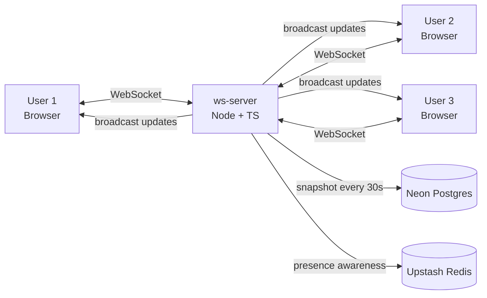

# CRDT Collaborative Document

> Notion-style real-time multiplayer text editor with cursor presence, conflict-free merging, and offline sync. Built on Yjs CRDTs, end-to-end TypeScript.

[](https://github.com/Utkarsh272/crdt-collab/actions)
[](https://www.typescriptlang.org)
[](LICENSE)

[Live demo](#) · [Architecture](#architecture) · [How CRDTs work](#how-crdts-work) · [Status](#status)

---

## What & Why

Real-time collaborative editing is a deceptively hard problem. Every multiplayer product — Notion, Figma, Linear — has an engineering story about how they handle conflicts when two users edit the same thing simultaneously.

This project implements that story from first principles, using **Conflict-free Replicated Data Types (CRDTs)** — a mathematical structure that guarantees any two replicas, no matter how many concurrent edits they've accumulated, will converge to the same state when they reconnect. No central arbiter, no last-write-wins, no merge conflicts.

The result: multiple users can edit the same document simultaneously, go offline and keep editing, and reconnect to a seamless merge — every time.

---

## Roadmap

> **Status**: 🔲 Planned — starts ~Week 7. See [timeline](#timeline) below.

| # | Milestone | Status |
|---|-----------|--------|
| 1 | Tiptap + Yjs local editor (single tab, no network) | 🔲 |
| 2 | WebSocket server — rooms, sync protocol, broadcast | 🔲 |
| 3 | Cursor presence via Yjs Awareness protocol | 🔲 |
| 4 | Postgres snapshots (Neon) + document persistence | 🔲 |
| 5 | Offline support via IndexedDB + reconnection sync | 🔲 |
| 6 | Multi-document UI — list, share by URL, title editing | 🔲 |
| 7 | Conflict scenario integration tests | 🔲 |
| 8 | Deploy (Vercel + Fly.io) + Prometheus metrics | 🔲 |
| 9 | README, DESIGN.md, demo video | 🔲 |

---

## Architecture



### WebSocket sync protocol

Initial connection sequence (Yjs sync sub-protocol):

```
Client                          Server
  │── SyncStep1(stateVec) ────▶ │   "Here's what I have"
  │◀── SyncStep2(serverDelta) ──│   "Here's what you're missing"
  │◀── SyncStep1(stateVec) ─────│   "Now tell me what I'm missing"
  │── SyncStep2(clientDelta) ──▶│
  │── Update(delta) ────────────▶│── broadcast to all room members
```

Every WS message is binary (`Uint8Array`) with a 1-byte type prefix. No JSON on the hot path.

### Snapshot strategy

Documents are kept in memory on the WebSocket server while active. Every 30 seconds (or 100 edits, whichever comes first), `Y.encodeStateAsUpdate(ydoc)` is persisted to Postgres as a full snapshot. On first connection, the latest snapshot is loaded and applied. Older snapshots beyond the last 50 are deleted asynchronously.

This trades write size (full state, not delta) for trivially simple recovery — load one row, done.

---

## How CRDTs Work

*(Full explanation at project completion — this is one of the key differentiators vs other Yjs demos.)*

**The short version**: In a traditional collaborative editor, one server resolves conflicts by picking a winner. CRDTs remove the need for that arbitration entirely.

A CRDT is a data structure with a mathematically guaranteed merge operation: given any two states A and B, `merge(A, B) = merge(B, A)` and `merge(merge(A, B), C) = merge(A, merge(B, C))`. This means you can apply updates in any order, from any replica, and always end up at the same result.

Yjs implements a CRDT called a **YATA** (Yet Another Transformation Approach) that models text as a list of items with unique IDs and causal ordering. When two users insert text at the same position, the CRDT uses the ID and timestamp to deterministically order the insertions — the same way, on every client, without coordination.

The practical result: offline editing just works. IndexedDB persists all local changes. When you reconnect, your client sends its state vector ("here's what I have"). The server sends back exactly the updates you missed. Yjs merges them. Done.

---

## Conflict Scenarios Tested

Integration tests will cover:
- Two users delete the same text range simultaneously
- User A formats a word bold while User B replaces it with new text  
- Long offline edit (100+ operations) merged with concurrent remote edits
- User disconnects mid-type and reconnects to a document with many changes

---

## Tech Stack

| Layer | Choice | Why |
|-------|--------|-----|
| Frontend | Next.js 14 + TypeScript + Tailwind | End-to-end TypeScript — closes the TS gap |
| Editor | Tiptap + ProseMirror | Industry-standard rich-text; first-class Yjs binding |
| CRDT | Yjs (v13+) | Most mature CRDT library; Tiptap has native support |
| WS server | Node.js + TypeScript + `ws` | Custom server based on y-websocket source — study the protocol |
| Offline persistence | `y-indexeddb` | Official Yjs provider |
| Cursor presence | `@tiptap/extension-collaboration-cursor` | Wraps Yjs Awareness for ProseMirror |
| DB | Neon Postgres (serverless, free) | Snapshot storage; supports document branching |
| Presence | Upstash Redis (free) | Ephemeral awareness state fan-out |
| Hosting | Vercel (FE) + Fly.io (WS server) | Fly has sticky session support for WebSockets |

---

## Planned Project Structure

```
/crdt-collab
├── /web                          # Next.js 14 + TypeScript
│   ├── /app
│   │   ├── /docs/[id]/page.tsx   # Editor page
│   │   └── /docs/page.tsx        # Document list
│   └── /components/editor
│       ├── editor.tsx            # Tiptap + Yjs binding
│       ├── remote-cursors.tsx    # Render others' cursors
│       └── presence-list.tsx     # Active users
└── /ws-server                    # Node 20 + TypeScript
    └── /src
        ├── server.ts             # WS upgrade + room routing
        ├── room.ts               # Per-doc state + broadcast
        ├── persistence.ts        # Debounced snapshots to Postgres
        └── awareness.ts          # Presence ephemeral state
```

---

## Honest Scale Note

The design targets 10 concurrent users per document on a single Fly.io instance. Beyond ~50, you'd need to shard documents across server instances or use `y-redis` for fan-out. That's documented in `DESIGN.md` as a known scaling boundary, not a bug.

---

## License

MIT
